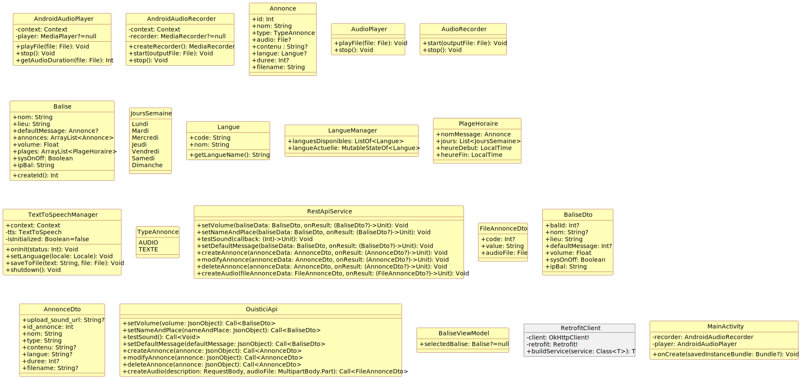

# OuisticiApp

Ouistici est une application mobile android permettant de configurer à distance des balises sonores. Ces balises peuvent êtres placées à différents types d'emplacements (Lieux publiques, particuliers, ...) et représentent une version peu onéreuse des balises que l'on connaît actuellement. Grâce à l'application, nous pouvons choisir les messages souhaités que la balise dira une fois la télécommande actionnée. On peut choisir un message par défaut mais aussi personnalisé les messages en fonction de plages horaires (Exemple : du lundi au vendredi de 8h à 12h la balise dira "Bienvenue à l'université de ..., notre accueil est ouvert est disponible sur votre droite ...").

# Sommaire

[Diagramme de classe](#classe)

## Diagramme de classe 

